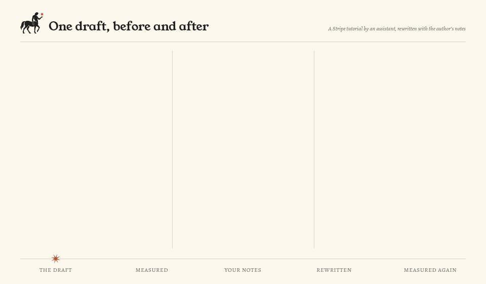

<p align="center">
  <picture>
    <source media="(prefers-color-scheme: dark)" srcset="assets/brand/hero/quiron-hero-dark.png">
    <source media="(prefers-color-scheme: light)" srcset="assets/brand/hero/quiron-hero-light.png">
    
  </picture>
</p>

<p align="center"><b>English</b> · <a href="README.es.md">Español</a></p>

<h1 align="center">Quirón: an AI humanizer skill that measures its own work</h1>

<p align="center">
  <b>An agent skill for Claude Code, Codex and Cursor. It strips the AI slop that marks prose as machine-written,<br>
  then checks the result against measured human writing instead of a hunch.</b>
</p>

<p align="center">
  
  
  
  <a href="https://skills.sh/ilien-dev/quiron/quiron"></a>
  <a href="https://quiron.ilien.dev/"></a>
</p>

Hand it a draft and ask it to humanize the text, or to make a README sound less like
ChatGPT. It rewrites the prose, then measures the result. You get the rewrite and a
measurement that says whether it now reads like a person wrote it.

## Install

With the [skills](https://skills.sh) CLI, for Claude Code and every other agent it
supports, Gemini CLI and GitHub Copilot among them:

```sh
npx skills add ilien-dev/quiron
```

It needs no API key. It runs on the model you already use, and the scripts need nothing
beyond the Python 3 standard library.

### As a Claude Code plugin

Run these two commands inside Claude Code:

```
/plugin marketplace add ilien-dev/quiron
/plugin install quiron@quiron
```

The plugin puts the skill under its own name, so you call it as `/quiron:quiron`.

## Demo: behind the scenes

<p align="center">
  <picture>
    <source media="(prefers-color-scheme: dark)" srcset="assets/demo/quiron-demo-dark.gif">
    <source media="(prefers-color-scheme: light)" srcset="assets/demo/quiron-demo-light.gif">
    
  </picture>
  <br>
  <sub>The animation shows what the skill does in the background. You won't see this screen when you run it,
  and it doesn't start a server or open a report: the model edits your text in the chat and gives you the meter's result there.</sub>
</p>

---

> [!IMPORTANT]
> **Use it responsibly.** Quirón is for text you write for yourself or your own team: a
> how-to guide, internal docs, meeting notes, a draft nobody outside the company will
> read. The point is text that feels close and easy to read, not text that pretends a
> person wrote it.
>
> Do not use it to pass AI writing off as human in public: social media, published
> articles, schoolwork, reviews, job applications, anything where the reader has a right
> to know who wrote it. Never use it to deceive or defraud anyone. It also does not beat
> AI detectors that read token probabilities, and it was not built to.

## What it catches

Ask a model for a blog post and you get a shape you learn to spot: lists of three, about
twice the headings a person would use, a summary section at the end, "it's not just X,
it's Y" and em dashes where a comma would do. Quirón gives the model a checklist of 33 of
these signs of AI writing and a meter that says in numbers whether the fix landed or went
too far.

*Delve* is not on the list anymore. On this repo's 2026 run it turned up in 1% of
assistant posts or fewer, roughly as often as in human ones. The words that give 2026
models away are ordinary ones you'd never flag by eye, used at many times the human rate
(the list is in [`references/word-choice.md`](references/word-choice.md)). The
other half of the signal is what's missing: models rarely write *very* or *able*, and
people use both all the time.

Here is the meter on an assistant-written Stripe tutorial from `eval/ai/blog/`:

```text
$ python3 scripts/aimeter.py eval/ai/blog/e2e-raw/aspittel-782713.md

feature                   this   human band      verdict
long words (7+) /1k     353.83   159.68 - 250.46  above band, AI side
nominalizations /1k      55.21     7.29 - 32.65   above band, AI side
em dashes /1k             3.76     0.00 - 2.74    above band, AI side
lists of three /1k       11.29     0.00 - 5.51    above band, AI side
plain words /1k          33.88    43.19 - 95.24   below band, AI side
...
13/23 features inside the human band (p10-p90 of 167 human texts)

! triads: retries, cancellations, and preventing, refund, tax, and privacy
```

The rewrite of the same post, built from the author's own notes, scores 23 of 23.

## How it differs from other humanizer skills

The best-known humanizer skills, [humanizer](https://github.com/blader/humanizer) and
[stop-slop](https://github.com/hardikpandya/stop-slop), give the model a list of AI
writing patterns to remove, and they work. So does [no-ai-slop](https://github.com/petergyang/no-ai-slop).
Stop-slop also has the model score its own draft from 1 to 10 on five questions.

Quirón has a pattern list too, but the model doesn't grade itself. A script measures 23
rates in the text and compares each one with the range found in human writing published
before ChatGPT. That catches a failure a checklist can't see. Tell a model to write like a
person and it usually overshoots: choppier and plainer than any person writes. The meter flags that as
loudly as the AI side.

## What backs it

Every rule and number traces to a published study or to a run of the scripts in this
repo. Nothing ships on "this reads better".

- **Human baselines.** The bands come from 167 dev.to posts and 157 WritingPrompts
  stories, all written before ChatGPT existed, plus a Spanish set. A quarter of each is
  held out and never used to pick anything.
- **2026 AI text on the same titles.** Claude Opus, Sonnet, Haiku and GPT wrote the
  comparison texts in `eval/ai/`, from the plain prompt a user would type.
- **Two failure modes.** Text can sit on the AI side of a band or *overshoot* past the
  human side. Overshoot is a tell too: models told to "write like a human" go choppier
  and plainer than any person does. The meter flags both.
- **Blind judges.** Fresh model judges read posts one at a time and guessed which were
  AI. That test produced the most important finding below. Since September 2026 every
  change to the rewrite rules is also judged by Claude and GPT judges on titles it was
  never tuned on, in English, Spanish and fiction; the harness is in `eval/e2e/`.

The details of how each number was measured are in [`SKILL.md`](SKILL.md) and
[`eval/README.md`](eval/README.md), along with the source of every rule.

## Tips for text that reads human

The judges were not fooled by style edits alone. A rewrite that put every rate inside
the human band was still judged AI 12 times out of 12. What moved them was the writer's
own material. So:

- **Start from something real.** Your notes, a rough draft, a Slack thread, a post-mortem.
  A model writing from a blank prompt has to invent everything. The judges' reasons for
  calling a post AI were things like "no concrete events" and "generic trend summary".
- **Give it the specifics.** What happened, the real names, the numbers you know, the
  links, what went wrong.
- **Say what you think.** Your opinion, what you are unsure of, the mistake you made.
  The model cannot supply that without making it up.
- **Hand over a sample of your writing** so the model can match how you write.
- **Stop at the human range.** Two or three passes of the meter is normal. Chasing 23 of
  23 is how you overshoot.

## Use

Ask your agent in plain words, or call `/quiron`:

```text
Humanize this post: [paste the text]
Make docs/launch.md sound less like AI. Here are my notes: [notes]
Check this email for AI tells, don't rewrite it yet.
```

The scripts run on their own too, from a clone of this repository:

```sh
python3 scripts/aimeter.py FILE        # 23 rates against the human bands
python3 scripts/audit.py --brief FILE  # the pattern checklist
scripts/check.sh FILE                  # one pass of the full loop
```

For fiction or Spanish, set `QUIRON_BANDS=scripts/bands-fiction.json` or
`scripts/bands-es.json`. Texts under about 120 words get no measurement.

Other languages get the same checklist as a best effort. There is no human baseline for
them yet. The meter says so and shows only the numbers that don't depend on the words,
such as paragraph length and headings.

## FAQ

**Does it get text past AI detectors like GPTZero or Turnitin?** No. Those tools read
token probabilities, and Quirón doesn't touch them. It works only on what a human reader
actually notices.

**Which models does it work with?** Any model behind an agent that loads skills. It was
tested on text from three Claude models and one GPT model.

**Does it make things up to sound human?** Its instructions forbid it. A rewrite may use only
facts from your text or your notes. `scripts/factdiff.py` lists the numbers and links in
the rewrite that the source doesn't have. When it needs detail it lacks, it asks.

## The name

Most centaurs in Greek myth were wild and violent. Chiron (*Quirón* in Spanish) was the
wise one: he taught Achilles, Asclepius and Jason, and he was a healer. When a poisoned
arrow wounded him, his immortality meant he could not die from it, so he gave it up,
and Zeus set him among the stars. The logo shows him holding that star.

He fits the skill in two ways. He was a teacher of people, and this skill teaches a
model how people write. And he was half man, half horse: the text Quirón helps produce
is a hybrid too. The model does the drafting, and the human part has to come from you.

## License

Free to use and change, under the [GNU AGPL v3](LICENSE) with one added term
in [`NOTICE`](NOTICE). Any work built on Quirón has to stay open under the same license,
including a modified version offered as a network service, and has to credit the
original: "Based on Quirón by ilien", with a link to this repository.
